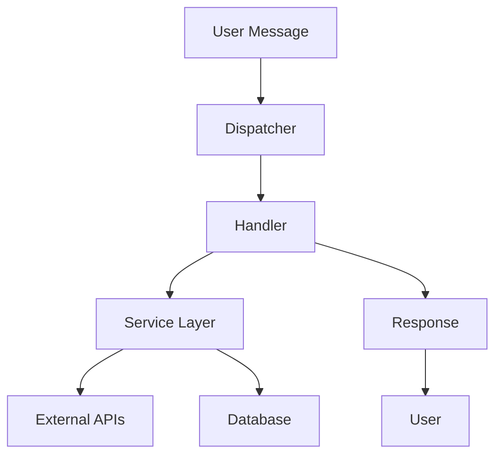

<div align="center">

# 🎓 KLAS Notification Bot

**A smart Telegram bot for Kwangwoon University students**

[](https://python.org)
[](https://telegram.org)
[](https://aiogram.dev)
[](https://sqlalchemy.org)

[](LICENSE)
[](tests/)

[🚀 Quick Start](#-quick-start) • [📖 Documentation](#-features) • [🛠️ Installation](#️-installation) • [🤝 Contributing](#-contributing)

</div>

---

> ## 🔱 About this fork
>
> This is a continuation of **[ChoiVadim/klas_notification_bot](https://github.com/ChoiVadim/klas_notification_bot)**,
> created by [Choi Vadim](https://github.com/ChoiVadim). The original design, the KLAS
> integration and virtually all of the implementation are his work.
>
> I ([Maksim Tyan](https://github.com/snowing152)) took over maintenance **with the
> author's permission** — I now run the public instance of the bot, keep it deployed, and
> continue development from here. The upstream repository remains the origin of this
> project and is credited in [LICENSE](LICENSE).
>
> Issues and pull requests about _this_ instance belong here; the original repository is
> not maintained by me.

---

## 🌟 Features

<table>
<tr>
<td width="50%">

### 📚 **Academic Management**

- 📋 **KLAS Integration** - View assignments, lectures, quizzes
- ⏰ **Smart Notifications** - Never miss a deadline
- 📊 **Student Dashboard** - Track your academic progress
- 🎯 **Todo Management** - Organized task tracking

</td>
<td width="50%">

### 🏫 **Campus Services**

- 🍽️ **Dining Menu** - Daily cafeteria updates
- 📰 **Campus News** - Latest KW announcements
- 📱 **Library QR** - Quick library access codes
- 🤖 **AI Assistant** - Chat about university life

</td>
</tr>
</table>

### 🌍 **Multi-Language Support**

- 🇺🇸 English
- 🇰🇷 Korean (한국어)
- 🇷🇺 Russian (Русский)

---

## 📱 Screenshots

<div align="center">


</div>

---

### Prerequisites

- 🐍 **Python 3.10+**
- 🤖 **Telegram Bot Token** ([Get one from @BotFather](https://t.me/botfather))
- 🔑 **Google Gemini API Key** (Optional, for AI features)

### ⚡ Installation

```bash
# Clone the repository
git clone https://github.com/snowing152/klas_notification_bot.git
cd klas_notification_bot

# Create virtual environment
python -m venv .venv

# Activate virtual environment
# Windows PowerShell
.\.venv\Scripts\Activate.ps1
# macOS/Linux
source .venv/bin/activate

# Install dependencies
pip install -r requirements.txt

# Generate encryption key
python -c "from app.utils.encryption import generate_key; generate_key()"
```

### 🔧 Configuration

Create a `.env` file in the project root:

```env
BOT_TOKEN=your_telegram_bot_token_here
GEMINI_API_KEY=your_google_gemini_api_key_here
ADMIN_ID=your_telegram_user_id

# Optional — sensible defaults are used when omitted
DATA_DIR=.                 # where bot_users.db and encryption_key.key live
ENCRYPTION_KEY=            # Fernet key; falls back to encryption_key.key when empty
KW_TZ=                     # leave empty: the bot forces Asia/Seoul, which KLAS requires
```

`ADMIN_ID` is your own numeric Telegram id — [@userinfobot](https://t.me/userinfobot)
will tell you yours. It gates the `/notify` broadcast command, and startup fails with a
clear error if it is missing or not a number.

### 🚀 Run the Bot

```bash
python main.py
```

---

## 🏗️ Architecture

<details>
<summary><b>📁 Project Structure</b></summary>

```
klas_notification_bot/
├── 📁 app/
│   ├── 📁 database/          # SQLAlchemy models & DB operations
│   ├── 📁 handlers/          # Telegram message handlers
│   ├── 📁 services/          # External API integrations
│   ├── 📁 utils/             # Helper utilities
│   ├── 📁 middleware/        # Anti-spam & other middleware
│   ├── 📄 bot.py            # Bot initialization
│   ├── 📄 config.py         # Settings management
│   ├── 📄 strings.py        # Multi-language strings
│   └── 📄 keyboards.py      # Telegram keyboards
├── 📁 tests/                # Test suite
├── 📁 images/               # Assets & screenshots
├── 📁 logs/                 # Runtime logs (gitignored)
├── 📄 main.py              # Application entry point
├── 📄 requirements.txt     # Runtime dependencies
└── 📄 requirements-dev.txt # Test dependencies
```

</details>

<details>
<summary><b>🔄 Data Flow</b></summary>



</details>

### 🧩 Core Components

| Component       | Description                                            |
| --------------- | ------------------------------------------------------ |
| **🤖 Bot Core** | `app/bot.py` - aiogram Bot & Dispatcher setup          |
| **🔗 Handlers** | `app/handlers/` - Message routing & processing         |
| **⚙️ Services** | `app/services/` - KLAS, Library, News, AI integrations |
| **💾 Database** | `app/database/` - User data & settings storage         |
| **🛡️ Security** | `app/utils/encryption.py` - Password encryption        |

---

## 🎮 Commands & Usage

### 📋 **Academic Commands**

| Command     | Description                            |
| ----------- | -------------------------------------- |
| `/start`    | 🏁 Welcome message & quick access menu |
| `/register` | 🔐 Login to KLAS system                |
| `/show`     | 📚 View assignments & deadlines        |
| `/info`     | 👤 Student information dashboard       |

### 🏫 **Campus Services**

| Command          | Description                     |
| ---------------- | ------------------------------- |
| `/menu`          | 🍽️ Today's cafeteria menu       |
| `/news`          | 📰 Latest campus news           |
| `/qr`            | 📱 Generate library QR code     |
| `/lregister`     | 📚 Login to library system      |
| `/search <book>` | 🔍 Search the library catalogue |

### ⚙️ **Settings**

| Command       | Description                                                     |
| ------------- | --------------------------------------------------------------- |
| `/language`   | 🌍 Change interface language (requires registration to persist) |
| `/unregister` | 🗑️ Delete stored credentials                                    |
| `/donate`     | 💝 Support the developer                                        |
| `/refund`     | ↩️ Refund a donation (reply to the payment message)             |

### 🔑 **Admin Only**

| Command   | Description                                                           |
| --------- | --------------------------------------------------------------------- |
| `/notify` | 📢 Broadcast to all users, e.g. `/notify en: Hello \| ko: 안녕하세요` |

Only the Telegram account matching `ADMIN_ID` in `.env` can use this. Each user receives
the version matching their language, falling back to the `en:` text.

### 🤖 **AI Assistant**

Simply send any text message to chat with the AI about university life!

---

## 🔔 Smart Notifications

The bot automatically monitors your KLAS account and sends notifications for:

- 📅 **Upcoming Deadlines** - Assignments due soon
- 🎯 **New Tasks** - Recently posted assignments
- ⏰ **Lecture Reminders** - Unwatched lectures
- 📊 **Progress Updates** - Academic milestone tracking

---

## 🧪 Testing

```bash
# Install test dependencies (includes requirements.txt)
pip install -r requirements-dev.txt

# Run all tests (coverage is enabled by default via pytest.ini)
pytest -v

# Run specific test category
pytest tests/unit/ -v
pytest tests/integration/ -v
```

### 📊 Test Coverage

- **Unit Tests** - Database, strings, encryption, QR generation, news cache, admin broadcast
- **Integration Tests** - Handlers, services

Tests run against a temporary SQLite database created per test, so running the suite
never touches your real `bot_users.db`.

---

## 🚀 Deployment

### 🐧 Linux Service (Systemd)

1. **Edit `botdaemon.service`** and replace the `<your-user>`, `<your-group>` and
   `/path/to/klas_notification_bot` placeholders with your real values.

2. **Copy service file:**

```bash
sudo cp botdaemon.service /etc/systemd/system/kwbot.service
```

3. **Enable and start:**

```bash
sudo systemctl daemon-reload
sudo systemctl enable --now kwbot.service
sudo systemctl status kwbot.service
```

4. **View logs:**

```bash
sudo journalctl -u kwbot.service -f
```

### 🚂 Railway

The bot is a worker — it polls Telegram and exposes no port, so no domain or health
check is needed. `railway.json` already pins the builder and start command.

**1. Attach a volume.** Railway wipes the container filesystem on every deploy. Without
a volume, `bot_users.db` is destroyed and every user has to register again. In the
service settings add a volume mounted at `/data`. 1 GB is plenty.

**2. Set the variables:**

| Variable         | Value                                     | Notes                                                       |
| ---------------- | ----------------------------------------- | ----------------------------------------------------------- |
| `BOT_TOKEN`      | from [@BotFather](https://t.me/botfather) |                                                             |
| `ADMIN_ID`       | your numeric Telegram id                  | ask [@userinfobot](https://t.me/userinfobot)                |
| `GEMINI_API_KEY` | Google AI Studio key                      | optional, powers the AI chat                                |
| `DATA_DIR`       | `/data`                                   | **required** — points the database at the volume            |
| `ENCRYPTION_KEY` | your Fernet key                           | **required** — see below                                    |
| `KW_TZ`          | —                                         | **leave unset.** Only to run on a timezone other than Seoul |

**3. `ENCRYPTION_KEY` is the one you cannot lose.** On an ephemeral filesystem the key
file would be regenerated on each deploy, which makes every password already in the
database **permanently undecryptable**. Generate it once and paste it into Railway:

```bash
python -c "from cryptography.fernet import Fernet; print(Fernet.generate_key().decode())"
```

Keep a copy somewhere safe. It is never recoverable from the database.

**4. Deploy.** `railway up`, or connect the GitHub repo for push-to-deploy.

> ⚠️ **Timezone.** KLAS reports every deadline in Korean local time and the bot compares
> it against the local clock, so a UTC container would compute every deadline nine hours
> off. `app/config.py` therefore _forces_ `TZ=Asia/Seoul` at import — it overwrites
> whatever the host set, because some platforms export `TZ=UTC` themselves and a mere
> default would be silently ignored there. Setting `TZ` in your deploy has no effect;
> the deliberate override is `KW_TZ`, and you almost certainly do not want it.

### 📝 Logging

The bot always logs to stdout, so Railway's dashboard (and `railway logs`) shows
everything. On a self-hosted Linux box it _additionally_ writes `logs/kwbot.log` inside
the project directory (created automatically, and gitignored); that file handler is
skipped on Railway, where the file would be lost on the next deploy anyway.

### 💾 What to carry across a redeploy

These are deliberately untracked — carry them with the bot, or your users will have to
register again:

| Item           | Why it matters                                                                                                                    |
| -------------- | --------------------------------------------------------------------------------------------------------------------------------- |
| `bot_users.db` | All registered users and their encrypted credentials. On Railway, keep it on the mounted volume.                                  |
| The Fernet key | **Lose it and every stored password becomes undecryptable.** `ENCRYPTION_KEY` env var, or `encryption_key.key` when self-hosting. |
| `.env`         | Bot token, Gemini key, admin ID                                                                                                   |

---

## 🛠️ Development

### 🔧 Setup Development Environment

```bash
# Install runtime + test dependencies
pip install -r requirements-dev.txt

# Run the test suite
pytest -v
```

### 📝 Contributing Guidelines

1. **Fork** the repository
2. **Create** a feature branch (`git checkout -b feature/amazing-feature`)
3. **Commit** your changes (`git commit -m 'Add amazing feature'`)
4. **Push** to the branch (`git push origin feature/amazing-feature`)
5. **Open** a Pull Request

---

## 🔒 Security & Privacy

- 🔐 **Encrypted Storage** - User passwords encrypted with Fernet
- 🛡️ **Anti-Spam** - Built-in rate limiting
- 🔑 **Secure Keys** - Environment-based configuration
- 🚫 **No Data Sharing** - Your data stays private

### ⚠️ Security Best Practices

- Never commit `.env` or `encryption_key.key`
- Rotate API keys regularly
- Use strong, unique passwords
- Keep dependencies updated

---

## 🆘 Troubleshooting

<details>
<summary><b>🔧 Common Issues</b></summary>

### Bot Won't Start

- ✅ Check `BOT_TOKEN` in `.env`
- ✅ Make sure `ADMIN_ID` is a number — a missing or placeholder value fails at startup
- ✅ Verify `ENCRYPTION_KEY` is set, or that `encryption_key.key` exists (see the generation step above)
- ✅ Ensure Python 3.10+ is installed

### KLAS Login Fails

- ✅ Verify KW credentials
- ✅ Check network connectivity
- ✅ Try re-registering with `/register`

### AI Assistant Replies With An Error

- ✅ Check `GEMINI_API_KEY` in `.env`
- ✅ Check `logs/kwbot.log` — an expired model name shows up here as a 404

### `/qr` Doesn't Work

- ✅ Register your library account first with `/lregister`
- ✅ Make sure `Pillow` is installed (it renders the QR image)

### Missing Dependencies

```bash
pip install --upgrade -r requirements.txt
```

### Permission Errors (Linux)

```bash
sudo chown -R $USER:$USER /path/to/bot
```

</details>

---

## 📄 License

This project is licensed under the **MIT License** - see the [LICENSE](LICENSE) file for details.

---

## 🤝 Contributing

Contributions are what make the open source community amazing! Any contributions you make are **greatly appreciated**.

<div align="center">

### 💝 Support the Project

If this bot helps you manage your university life better, consider supporting it
with the `/donate` command inside the bot (Telegram Stars ⭐).

**⭐ Star this repository if you found it helpful!**

</div>

---

<div align="center">

**Made with ❤️ for Kwangwoon University students**

Originally created by [Tsoi Vadim](https://github.com/ChoiVadim).
Currently maintained by [Maksim Tyan](https://github.com/snowing152) with the author's blessing.

[🔝 Back to Top](#-klas-notification-bot)

</div>
